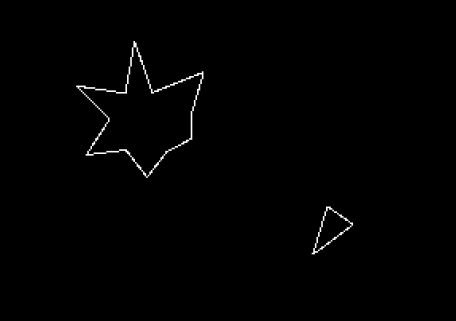

# ECS Asteroids



A recreation of the classic Atari game Asteroids using Go, Ebiten, and an Entity Component System (ECS) architecture. The game features both desktop and mobile support through WebAssembly. Publishing to 

To stay in line with the original Asteroids, all graphics are generated from lines drawn on the screen using built-in libraries instead of loading assets.

## Features

- Classic Asteroids gameplay with vector graphics
- Entity Component System (ECS) architecture for clean, modular code
- Multitouch support for mobile devices
- Desktop and mobile web browser support via WebAssembly
- Responsive design that works on various screen sizes

## Build & Run

### Desktop Version

Built with Go and [Ebiten v2](https://github.com/hajimehoshi/ebiten).

```bash
go build
./ecs-asteroids
```

### WebAssembly Version (for mobile/web)

To build and run the WebAssembly version:

```bash
# Build the WebAssembly binary
GOOS=js GOARCH=wasm go build -o web/game.wasm

# Copy the WebAssembly support files
cp "$(go env GOROOT)/misc/wasm/wasm_exec.js" web/

# Serve the files (using Python's HTTP server as an example)
cd web && python -m http.server 8080
```

Then open `http://localhost:8080` in your web browser. For mobile testing, use your computer's local IP address.

## Controls

### Desktop Controls
- Arrow keys or WASD: Control ship movement
  - Up/W: Thrust forward
  - Left/A: Rotate left
  - Right/D: Rotate right
- Space: Fire
- Any key: Restart game after game over

### Mobile/Touch Controls
- Touch and drag anywhere (except fire button): Control ship movement and rotation
- Red button (bottom left): Fire
- Touch anywhere: Restart game after game over

## Game Features
- Three lives per game
- Increasing difficulty with more asteroids
- Score tracking
- Temporary invulnerability after respawn
- Particle effects for explosions

## Architecture

The game uses an Entity Component System (ECS) architecture with the following main components:

- Systems:
  - Input System (keyboard, mouse, and touch input)
  - Player System (lives and scoring)
  - Movement System (physics and wrapping)
  - Collision System (hit detection and response)
  - Render System (vector graphics)
  - Asteroid Spawner System (game progression)
  - Explosion System (particle effects)
  - Invulnerable System (post-respawn protection)

## Development

The game is open source and contributions are welcome. Feel free to submit issues or pull requests!
